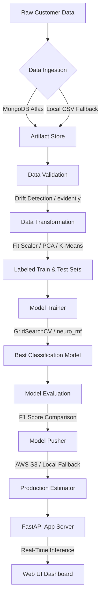

# 🚀 PrecisionCustomer – AI-Powered Customer Segmentation System

[](https://www.python.org/)
[](https://fastapi.tiangolo.com/)
[](https://scikit-learn.org/)
[](https://www.docker.com/)
[](https://opensource.org/licenses/MIT)

An end-to-end, production-ready machine learning system that profiles and segments retail customers based on demographic features and purchase behavior. This system helps marketing and sales teams identify high-value cohorts and optimize promotional campaigns dynamically.

**Developed and Upgraded by:** [Raghvendra Bhati](https://github.com/raghvendrabhati02)  
*AI Engineer | Data Science Student | Machine Learning & Generative AI Enthusiast*

---

## 🛠️ Key Improvements & Portfolio Enhancements

This project is a heavily upgraded version of the open-source *iNeuron Customer Categorizer* template. The following software engineering and machine learning improvements have been implemented:

1. **Stateful PCA & K-Means Persistence**: Fixed a critical ML bug where K-Means and PCA were fit separately on train and test datasets. Refactored the pipeline to fit these models **only on the training set** and persist them. The fitted models are loaded dynamically during inference.
2. **Robust Offline Fallback Mode**: Modified the data ingestion component to check for MongoDB Atlas connectivity. If unavailable, it falls back to loading data from local CSV storage seamlessly, allowing local runtime support out of the box.
3. **Pydantic Data Validation**: Implemented rigid type validation for the prediction API payload using Pydantic.
4. **Tailwind Glassmorphic Web UI**: Replaced the outdated plain form with a modern multi-tab form layout. Included one-click **Demo Customer Generators** to quickly populate data, along with interactive visual spending breakdowns using **Chart.js**.
5. **Standard scikit-learn Fallback Trainer**: Safely wrapped the custom `neuro_mf` model selection engine in a try-except block, providing a standard `GridSearchCV` model search (comparing Logistic Regression and Random Forests) if the custom package is missing.
6. **Dynamic Metrics Calculation**: Eliminated mock training scores by evaluating F1, Precision, and Recall scores directly on the test set.
7. **Clean Production Structure**: Upgraded the containerization base to `python:3.11-slim` and cleaned up copypasta log statements referencing sensor or truck fault detection templates.

---

## 📋 Table of Contents
- [Project Architecture](#-project-architecture)
- [Project Layout](#-project-layout)
- [How to Run (Local Setup)](#-how-to-run-local-setup)
- [Docker Execution](#-docker-execution)
- [API Documentation](#-api-documentation)
- [Portfolio Attribution](#-portfolio-attribution)

---

## 🏗️ Project Architecture



---

## 📂 Project Layout

See [PROJECT_STRUCTURE.md](PROJECT_STRUCTURE.md) for a detailed view of all files.

---

## 🚀 How to Run (Local Setup)

### Prerequisites
- Python 3.11+
- Git

### Step 1: Clone the Repository
```bash
git clone https://github.com/raghvendrabhati02/Customer_segmentation.git
cd Customer_segmentation
```

### Step 2: Create a Virtual Environment
```bash
python -m venv venv
# Windows activate
venv\Scripts\activate
# macOS/Linux activate
source venv/bin/activate
```

### Step 3: Install Dependencies
```bash
pip install -r requirements.txt
```

### Step 4: Export Environment Variables (Optional)
Create a `.env` file in the root directory:
```env
MONGODB_URL="your-mongodb-atlas-connection-string"
AWS_ACCESS_KEY_ID="your-aws-key"
AWS_SECRET_ACCESS_KEY="your-aws-secret-key"
```
*Note: If no connection strings are supplied, the application will run using its offline dataset and save models to local directory structures.*

### Step 5: Start the FastAPI App Server
```bash
python app.py
```
The server will start at `http://localhost:5000`.

### Step 6: Train the Model (Optional)
Run the training pipeline manually via:
- Web: `http://localhost:5000/train`
- CLI: `curl http://localhost:5000/train`

---

## 🐳 Docker Execution

Build the Docker image:
```bash
docker build -t precision-customer .
```

Run the container:
```bash
docker run -p 5000:5000 --env-file .env precision-customer
```

---

## 🔌 API Documentation

### 1. Web UI Dashboard
- **Endpoint**: `GET /` or `GET /predict`
- **Description**: Access the interactive Tailwind dashboard, prefill demo profiles, submit segmentation requests, or upload batch CSV files.

### 2. Predict Customer Cohort (JSON API)
- **Endpoint**: `POST /api/predict`
- **Payload**:
  ```json
  {
    "Age": 45,
    "Education": 2,
    "Marital_Status": 1,
    "Parental_Status": 1,
    "Children": 2,
    "Income": 52000.0,
    "Total_Spending": 680.0,
    "Days_as_Customer": 450,
    "Recency": 15,
    "Wines": 350,
    "Fruits": 40,
    "Meat": 180,
    "Fish": 20.0,
    "Sweets": 30,
    "Gold": 60.0,
    "Web": 5,
    "Catalog": 2,
    "Store": 7,
    "Discount_Purchases": 3,
    "Total_Promo": 1,
    "NumWebVisitsMonth": 5
  }
  ```
- **Response**:
  ```json
  {
    "status": true,
    "prediction": {
      "cluster": 0,
      "persona": {
        "name": "Value-Seeking Family",
        "description": "Budget-conscious families with children...",
        "spending_tier": "Medium-Low",
        "strategy": "Target with coupons and family bundle offers..."
      }
    }
  }
  ```

---

## 🤝 Portfolio Attribution

This repository is maintained as part of a personal AI/ML engineering portfolio. 

- **Original Author/Credits**: iNeuron.ai Open Source Template
- **Upgrades, Refactoring, & UI Redesign**: [Raghvendra Bhati](https://github.com/raghvendrabhati02)
- **License**: Licensed under the [MIT License](LICENSE).

## Latest Updates

- Improved project documentation.
- Enhanced project structure.
- Ongoing maintenance and feature improvements.
